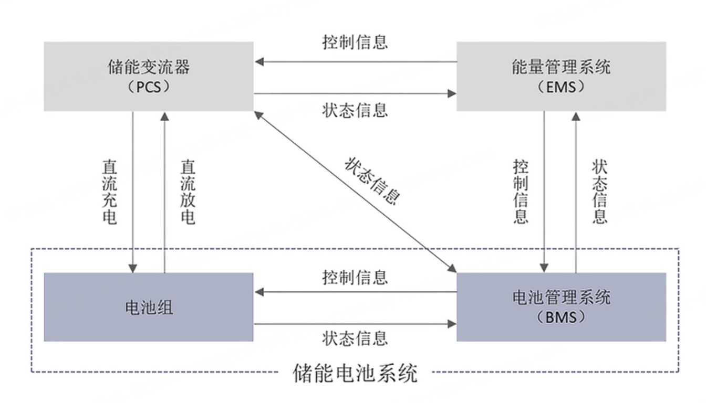
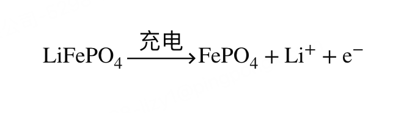

### 什么是电池储能

电池储能系统（ Battery Storage 或 BESS）是指利用化学电池将电能储存起来，并在需要时释放出来的技术和系统。 基主要组成

- 电池组 , 能量存储
  > 由许许多多的小电池块（电芯）串联、并联拼成，把电能以化学能的形式存起来。目前最流行的就是磷酸铁锂电池组。
- 储能变流器（PCS）可以控制储能，电池组的充电和放电过程，进行交直流的变换
  > 紧盯每一个电芯的温度、电压、电流。一旦发现哪块电池太热了、或者电充得太满了，它就会立刻报警或切断电路，防止电池起火或损坏。 
- 电池管理系统（BMS）负责电池的监测、评估、保护以及均衡等
  > 紧盯每一个电芯的温度、电压、电流。一旦发现哪块电池太热了、或者电充得太满了，它就会立刻报警或切断电路，防止电池起火或损坏。
- 能量管理系统（EMS） 负责数据采集、网络监控和能量调度等
  > 它是套软件系统，负责看天气预报、看今天的电价。比如它算到凌晨 2 点电价最便宜，就下令让 PCS 开始充电；下午 2 点工厂用电高峰且电价最贵，它就下令放电。
- 其他电气设备
   - 温控系统（Air Conditioning/Liquid Cooling）：电池很怕热，需要空调或液冷给它们降温。
   - 消防系统（Fire Suppression）：万一电池短路起火，自动喷洒惰性气体或水雾灭火。
   - 变压器、配电柜：负责把电压升高或降低，匹配电网。

同时，外部的急停按钮信号直接连接PCS、BMS、EMS，在紧急情况下能及时让设备停下来，保证设备安全。处急停信号外，消防、柜门行程开关等外部信号也接入EMS，为设备增加安全保障。

在每个电池包内含电池管理系统（BMS）的从控模块（BMU），电池管理系统（BMS）通过对从控模块（BMU）反馈的电芯温度、电压等信息对电池状态进行分析，提供对电芯的保护，提高电池包（PACK）间的一致性，提高效率的同时还增加储能系统的安全性。

液冷机组通过通讯线接入EMS，并读取BMS反馈上来的电芯参数，通过自身内部逻辑运行，实时监控电芯温度变化，动态启停，节省自耗电的同时也保证了电芯的温度，使得电芯的寿命更加大。

#### 汽车上的储能

汽车本质上也是一个移动的电池储能系统，但因为汽车需要“跑起来”，它的电气结构和静止不动的储能电站有很大的区别。一辆电动汽车的动力系统，主要由以下核心部件构成：

- 电池组（Battery Pack）—— 能量源
- 车载 BMS（电池管理系统）—— 安全大管家
- 在汽车里，PCS功能被拆分成了两个独立的部件
  - 车载充电机（OBC - On-Board Charger）—— 负责充电
    > 当你插上家里的交流充电桩时，OBC 负责把墙上出来的交流电（AC）变成直流电（DC）充进电池。
  - 电机控制器（MCU - Motor Control Unit）—— 负责开车
    > 它是汽车特有的。电池输出的是直流电，但汽车的驱动电机（Motor）需要交流电才能运转。MCU 负责把电池的直流电变成交流电驱动电机。当你踩油门时，MCU 决定放多少电、让车跑多快；当你踩刹车时，它还能把动能回收成直流电充回电池。  
- 汽车里没有储能电站EMS, 汽车的能量调度是由车上的 整车控制器（VCU - Vehicle Control Unit） 或者现在流行的 中央计算平台（域控制器） 来兼任的。它负责分配屏幕、空调、电机各自用多少电。

### 电池是如何储存能量

电池存储和释放能量的本质是原子和电子的量子化转移，也就是化学上的“氧化还原反应”（Redox Reaction）。以磷酸铁锂（LFP）电池为例

- 正极（过渡金属氧化物）：像一栋钢筋混凝土的大楼。由过渡金属（如铁、钴、锰、镍）与氧原子紧密结合，撑起一个非常坚固的晶体骨架（如层状结构或隧道结构），锂离子平时就住在骨架的缝隙里。

- 负极（石墨）：像一叠整齐平铺的白纸。石墨由纯碳原子组成，微观上是一层一层的碳网（石墨烯层）。层与层之间没有什么强大的化学键，只有微弱的分子间引力，正好可以留出空隙让锂离子“夹”在中间。

-  锂原子（Li）：非常慷慨。它是元素周期表里最轻、活泼度极高的金属。由于它最外层只有1个电子，极度渴望把这个电子“送出去”，从而让自己变成稳定的锂离子。

#### 充电时的“移交”关系（氧化还原）

- 过渡金属被氧化（失去电子）：外接电源强行从正极的过渡金属（例如三价铁 \($\text{Fe}^{3+}$\) 或三价钴 \($\text{Co}^{3+}$\)）身上抢走一个电子。过渡金属被逼化合价升高（变成 \($\text{Fe}^{4+}$\) 或 \($\text{Co}^{4+}$\)）。由于失去了电子的平衡，原本住在正极晶格里的锂离子（\($\text{Li}^{+}$\)）被排斥出来，被迫离开老家。石墨接收电子和离子：被抢走的电子顺着外电线流到了负极的石墨层。同时，游过来的锂离子也钻进了石墨的层间空隙，与电子重新会合

- 石墨接收电子和离子：被抢走的电子顺着外电线流到了负极的石墨层。同时，游过来的锂离子也钻进了石墨的层间空隙，与电子重新会合。

#### 放电时的“回归”

放电时，过渡金属展现出强大的“吸电子能力”，引发了逆向运动：
- 由于过渡金属骨架处于高价态，它极度渴望拿回属于自己的电子。
- 于是，石墨层里的电子自发通过外电路奔回正极，重新把过渡金属还原回低价态。
- 为了保持电荷平衡，躲在石墨层里的锂离子也自发钻出石墨，游回过渡金属撑起的大楼里。

#### 容量衰减和功率衰减

1. 充电和放电需要“活的”锂离子在正负极之间来回奔跑。但在奔跑过程中，一部分锂离子会因为各种原因被“困住”

   - SEI膜的钝化：负极（石墨）表面有一层保护膜叫 SEI 膜。每次充电时，这层膜都会不可避免地“吃掉”一点点锂离子并变厚。
   - 锂枝晶的形成：如果充电过快或在低温下充电，锂离子来不及钻进石墨层，就会在负极表面堆积，像树枝一样长出来（称为枝晶）。这些“树枝”断裂后，里面的锂离子就变成了无法参与反应的“死锂”。

2. 负极石墨层“塌方”（结构破坏） 与 正极过渡金属大楼“风化”（晶格塌陷）
    - 每一次充电，锂离子强行挤进石墨层（微观上体积会膨胀约 10%）；放电时，锂离子离开，石墨层又缩回。这种“反复膨胀-缩小”的物理应力，经历几千次后，会导致石墨的微观层状结构发生断裂、错位和塌方。   
    - 过渡金属原子在激烈的化学反应中，可能会发生位置错乱（相变），或者金属离子溶解到电解液里。大楼的梁柱（晶格）一旦断裂，正极内部的微观隧道就会被堵死。

3. 电解液“干涸”与内阻增大（交通拥堵）
   - 电解液是锂离子游动必须依赖的液体环境。在高电压、高热量的刺激下，电解液自身的化学分子会缓慢发生副反应，逐渐分解、干涸并产生气体（这就是为什么有些老旧手机电池会“鼓包”）。
   - 电解液变质变粘后，锂离子在里面的游动速度大幅减慢。在物理上，这表现为电池的内阻（Internal Resistance）增大。

### 二代刀片电池

二代刀片电池通过“改写石墨结构（让锂离子好进） + 换掉电解液（让锂离子好跑） + 升级全包覆液冷（让热量好散） + 聪明算法（不盲目硬塞）”，把原本不可兼得的“快充”与“长寿”完美揉在了一起。

- 正极材料中引入了过渡金属“锰”，将传统的磷酸铁锂（LFP）升级为了磷酸锰铁锂（LMFP）， 提升了电压（拉力）,提高续行
   > 以前，1000 个锂离子跑一圈，只能提供 3200 瓦时的能量。
   > 现在，1000 个锂离子跑一圈，能提供 3800 瓦时的能量。
- 对负极石墨进行了微观改性（各向同性化处理），并加入了特殊的碳纳米管导电剂。这使得石墨颗粒变成了3D立体的多面开门结构。
- 二代刀片电池配方中，引入了新型的低粘度溶剂和双氟磺酰亚胺锂（LiFSI）添加剂。进行 电解液升级
- 利用刀片电池本身“又长又薄”的扁平优势（散热面积大），二代采用了全包覆式液冷技术。冷板就像一个贴身的冰丝套，把每一片刀片电池的四周紧紧包裹住。
- 二代处理：BMS 内部建立了一个“微观电化学机理模型”。它能实时推算出此时此刻，负极石墨层里还剩多少空房间，以及锂离子的游动速度。
  > 在电量低（如 10%–50%）房间多时，允许电流全速冲刺；当电量达到 70% 后，算法会敏锐察觉到石墨层快满了，于是主动、平滑地调小电流，引导剩下的锂离子慢慢排队进去。

 ### 固态电池

 固态电池的绝对本质，就是“把液态电解液替换为固态电解质”。

- 液态电池时代：因为中间是液体 ➔ 容易长枝晶、会发生副反应 ➔ 必须找石墨把锂离子关起来 ➔ 导致电池很重、续航短。
- 固态电池时代：把液体换成固体（陶瓷或硫化物） ➔ 中间变成了一堵钢板一样硬的墙 ➔ 锂枝晶根本长不出来，也无法发生液体副反应 ➔ 终于可以把石墨扔掉，换回纯金属锂负极 ➔ 续航瞬间翻倍。

> 纯金属锂负极能让续航翻倍，本质原因：体积缩小（空间暴增）和质量极轻。

| 对比维度 | **半固态电池 (主流过渡)** | **全固态电池 - 硫化物流派 (正统终极)** | **全固态电池 - 氧化物陶瓷流派 (中国特色)** |
| :--- | :--- | :--- | :--- |
| **技术方式** | **固液混合**（含 5%–10% 电解液） | **全固态**（0% 一滴水都不含） | **全固态**（0% 一滴水都不含） |
| **核心材料** | 超高镍三元正极 + 氧化物陶瓷隔膜 + 少量液态电解液 | 三元锂/富锂锰基正极 + **硫代磷酸锂**电解质 + 纯金属锂负极 | 三元锂正极 + **LLZO/LATP陶瓷薄片** + 石墨掺硅/锂金属负极 |
| **核心优点** | 1. **实现量产**：兼顾现有产线，成本低。 2. **能量突破**：续航轻松达 1000 公里。 3. **改善安全**：漏液风险大降。 | 1. **充放电极快**：离子传导率直追液体。 2. **物理封杀枝晶**：循环寿命长达几万次。 3. **续航翻倍**：能量密度达 500Wh/kg 以上。 | 1. **绝对安全**：陶瓷极耐高温、耐高压。 2. **化学性质稳定**：空气中不分解、不产生毒气。 3. 抗氧化能力强。 |
| **致命缺点** | 1. 依然保留液体，无法根除起火隐患。 2. 性能提升已达瓶颈，属于过渡技术。 | 1. **极度怕水**：见空气产生剧毒硫化氢。 2. **制造恶梦**：全流水线需极度干燥的真空。 3. 价格昂贵。 | 1. **界面阻抗极大**：硬石头贴硬石头，锂离子跳不过去。 2. **脆性太大**：陶瓷太脆，生产线高速运转极易碎裂。 |
| **工艺做法** | 沿用传统卷绕/叠片工艺，最后一步**“减量注液”**或使用凝胶。 | 采用革命性的**“干法电极”工艺**，通过高压将固体粉末直接压紧。 | 使用精密的**“电子陶瓷流延/薄片烧结”工艺**，做成纳米级陶瓷片。 |
| **2026年 最新商业进度** | **全面爆发期**：蔚来、智己等量产装车，并大批量应用于**低空经济（无人机/eVTOL）**。 | **示范装车期**：宁德时代、丰田等均已建成试产线，进行**高档车型示范试验**。 | **联合混搭期**：纯陶瓷全固态极少单打独斗，多被做成颗粒混入半固态中。 |
| **A股对应 板块/公司** | 天赐材料、新宙邦（供应其添加剂/凝胶）；当升科技（正极） | 宁德时代、比亚迪、吉利；干法电极设备厂（如纳科诺尔） | 东方锆业、三祥新材（锆矿原材料）；金龙羽、上海洗霸 |
