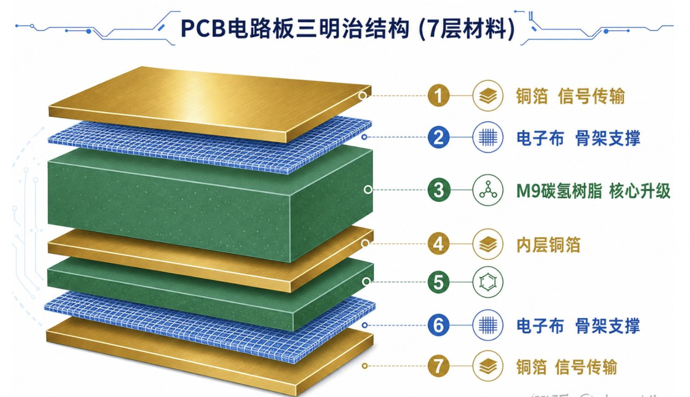

### 什么是PCB？


PCB（Printed Circuit Board）的中文全称是印制电路板（又称印刷电路板）。它在所有电子设备中核心承担着“承前启后、通电导网”的作用。
把外壳比作“皮肤”，那么 PCB 就是整个设备的“骨骼”与“神经血管”。
 - 机械支撑与固定，芯片、电阻、电容、各种插槽体积和重量各异，PCB 利用其坚韧的基材（如玻璃纤维），让这些元件能牢牢焊接、固定在板面上
 - 神经血管：电气连接与信号传输。通过板面上和内部精密蚀刻的铜箔线条，将电源处的电流精准输送到各个需要供电的芯片和元件上。

有了 PCB，电路完全符号化、标准化。只要设计好一张图纸，贴片机（SMT）就能以极高的速度，自动、精准、成千上万地将元件贴在同一位置，极大提高了生产品质并降低了维修难度。


### PCB结构

PCB不是一块实心的绿板子，而是很多层材料压合在一起，像三明治。


从上到下，大概是这样：

1. 第一层：铜箔（导电，走信号）
2. 第二层：玻璃纤维布（骨架，支撑）
3. 第三层：树脂（粘合剂，绝缘）
4. 第四层：内层铜箔（走内部信号）
5. 第五层：树脂
6. 第六层：玻璃纤维布，电子布
7. 第七层：铜箔

普通手机的PCB大概8层，AI服务器的PCB动辄40层、50层，甚至超过80层。

这三种核心原料——铜箔、玻璃纤维布（电子布）、树脂——就是PCB的"砖瓦钢筋"，缺一不可。

- 铜箔, 导电，板子的“血管”  
- 树脂，板子的“骨骼”， FR-4（玻璃纤维环氧树脂）：全球最常用的绝对主力材料。它由环氧树脂和电子级玻璃纤维布压制而成。结构极度坚硬，耐热、耐潮，我们在电脑主板、显卡上看到的硬质绿板，90% 以上都是它。
- 玻璃纤维布（电子布）， 它提供超强的机械强度（纯粹的环氧树脂（塑料）在受热或受力时非常脆弱，极易弯曲、折断或受热变形），及完美的电气绝缘体。

#### PCB等级M6-9

FR-4 不是一种单一材料，而是一个“技术标准等级”。 只要电路板的基材是由“玻璃纤维布 + 环氧树脂（或改性树脂）”组合而成，且具备阻燃性（符合 UL94 V-0 标准），它在行业里就被统称为 FR-4。

M7、M8、M9 是在这个标准下进化出的“贵族俱乐部”。 它们的骨架依然是玻璃纤维布，它们的基本制造原理也和普通 FR-4 一模一样。但为了应对 AI 服务器的高速信号，工程师把里面普通的树脂换成了神级成分


| 维度 | 普通 FR-4（常规电脑/家电主板） | M7 / M8 / M9 级别（AI服务器/交换机） |
| :--- | :--- | :--- |
| **里面的树脂** | 基础环氧树脂（DGEBA等） | PPO（聚苯醚）+ 碳氢树脂 的神级混合物 |
| **里面的电子布** | 普通 E-玻璃布 | 低介电（Low-Dk）玻璃布，M9 甚至用石英布 |
| **信号损耗 (Df)** | 0.02 左右（损耗极大） | 0.0012 ~ 0.0018（低了10倍以上，接近无损） |
| **抗热能力 (Tg)** | 约 130℃ - 150℃ | 190℃ - 210℃ 以上（AI芯片发热大，必须极度耐热） |
| **支持的传输速率** | 10 Gbps 以下（再高信号就断了） | 112 Gbps 至 224 Gbps+（专门跑 AI 算力海量数据） |
| **价格差距** | 基础款，非常便宜 | 普通 FR-4 的 6 到 20 倍以上 |


#### 三种核心材料


1. 铜箔——公路本身。 PCB里负责走信号的，是铜。铜箔就是PCB里那层薄薄的铜，信号电流就顺着铜线路跑。

    >普通铜箔没问题，但AI服务器信号频率太高，普通铜箔表面粗糙，信号跑着跑着就"摔跤"了（专业叫"趋肤效应损耗"）。所以M9级PCB需要HVLP铜箔——表面极度光滑，信号不摔跤，损耗大幅降低。
  

2. 电子布（玻璃纤维布）——骨架,PCB里的玻璃纤维布，作用就是骨架，让板子不变形、不开裂。就像混凝土里的钢筋。

    >AI服务器PCB层数多、孔多、温度高，对骨架的要求大幅提升。M9级PCB用的是低介电玻璃纤维布（Q玻纤/低Dk布），纤维更细、更均匀，信号穿过去损耗更小。

3. 碳氢树脂——灵魂核心，最卡脖子, 树脂是PCB里的粘合剂，把铜箔和玻璃纤维布压在一起，同时起绝缘作用。
   > 以前用的是普通环氧树脂——便宜、够用，但信号损耗大，AI时代不够看。
     M9级PCB用的是碳氢树脂（CH树脂），特点是：
   >   - 分子结构里几乎没有极性基团
   >   - 不吸水（吸水会导致信号不稳定）
   >  - 介电损耗极低（信号跑过去几乎不耗散）

#### 钻针——容易被忽略的消耗品
PCB是多层压合的，层与层之间需要打孔，让铜线路穿过去连通。打孔的工具叫钻针——比头发丝还细的微型钻头，直径有时不到0.1毫米。

> 以前的PCB，材料软，一根钻针能打一两千个孔才废掉。
  但M9材料硬度大幅提升，同样一根钻针，打几百个孔就磨废了。而AI服务器PCB，一块板子就有几万个孔。

算一下：孔数多了、钻针寿命短了、换针频率大幅提升，钻针消耗量成倍增长。而且孔越来越小、越来越密，对钻针的精度要求也是天花板级别的。

这就是为什么钻针是AI PCB产业链里景气度兑现最直接的细分——它是纯消耗品，钻完就废，持续复购，不存在"装好了就完事"的逻辑。

#### 整条产业链

现在把所有东西串在一起：


```
英伟达要做新一代AI芯片（Rubin架构）
        ↓
芯片要跑超高速信号，PCB必须用M9材料
        ↓
M9材料需要：
  ├── 碳氢树脂（东材科技）
  ├── 低Dk电子布（宏和科技等）
  └── HVLP铜箔（铜冠铜箔等）
        ↓
上述材料压合成覆铜板CCL（生益科技、南亚新材等）
        ↓
覆铜板加工成PCB成品（沪电股份、胜宏科技等）
        ↓
PCB上打几万个微孔，大量消耗钻针（鼎泰高科等）
        ↓
成品PCB运到台积电/英伟达组装线，焊上芯片
```


### PCB工艺

制作一块 PCB 是一场“从虚拟到现实”的精密化学与机械加工过程。

- 开料， 主要包含大板分切、边缘磨角与高温烘烤，旨在将大型原始覆铜板（CCL）加工为尺寸标准、边缘光滑且无内应力的小块板材。
- 钻孔，在多层大楼（电路板）内部开凿“电梯井”和“管道通孔” 。打通无数个微型的垂直通道，为后续“电镀沉铜”、连接各层电路奠定物理基础。
- 镀孔，在原本绝缘的钻孔内壁上，成功“长”出一层均匀的金属铜，从而将原本孤立的多层电路板在垂直方向上彻底导通。
- 涂感光油墨，光溜溜的铜箔表面，均匀地铺上一层对紫外线极度敏感的“工业胶卷”
- 曝光，被光照到的油墨会发生化学反应，瞬间变得坚硬、无法溶解；而没被光照到的区域依然保持松软
- 显影，用弱碱性药水（如碳酸钠）冲洗板子。那些没被光照到、保持松软的油墨会被药水全部冲走，露出下面大片不要的纯铜
- 蚀刻，紧接着送入强酸机，裸露的铜被吃掉，受硬化油墨保护的铜线安全留下来，最终蜕变成真正的电路
- 去膜，利用强碱性药水，将那些在蚀刻过程中立下大功、但此时已经变成“垃圾”的变硬感光膜（油墨）彻底从线路上剥离并清洗干净，从而让真正亮闪闪的纯铜线路“裸露”出来。即 “撕掉保护贴纸”
- 检查， 测试电路的完整性

以上是 酸性蚀刻的流程，同理还有碱性蚀刻。但它们在生产线上有极其明确的分工：内层电路主要用酸性，外层电路主要用碱性

- 碱性蚀刻： 速度极快，产能恐怖
- 酸性蚀刻： 精度惊人，线路更完美


#### 后处理

是让这些娇嫩的裸露铜线“穿上衣服防生锈、打上标签防装错、切成外形防短路”

- 阻焊工艺，精准地把需要焊接芯片引脚的“焊盘”露出来，而其他不需要焊接的铜线，全部被绿油死死包裹封印起来
- 丝印字符（Silkscreen）：盖上指路明灯的“印章”，标识出各元器件位置
- 表面处理：保护故意露出来的铜焊盘不氧化。 主要用：高纯度贵金属及有机保护剂，如镍，锡。。。
- 成品成型：在整个生产过程中，PCB 都是在一张大大的方块工作板（Panel）上进行加工的。**现在的电脑主板各种奇形怪状**，要与它们适配
- 终检：成品主板送入飞针测试机或针床测试机，用几千根测试针通电检测每一个网络。
